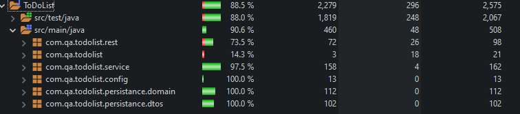

Coverage: Currently at 90.6% on the src/main.




# To Do List Project

This is a simple To-Do list project that enables the user to interact with a webpage and perform simple CRUD functionality.  
This project allowed me to explore further technologies such as SpringBoot - as well as the front end tech with entails JavaScript and HTML.  
The project document folder contains my risk assessment, PPT, and certain relevant images  with repect to the project.  


## Getting Started

The below instructions will get you a version of the project up and running in a local environment for developing and testing purposes.  
1. clone and fork  
2. open in IDE as maven/spring prj  
3. Open CLI in the folder where the .jar file is located
4. Run the command `java -jar <filename>` and this should start up the tomcat server 
5. head over to `localhost:8080.index` for the landing page   
6. load up postman use the URLS to test the functionality is working  
7. you can also head to localhost:8080/h2-console to checkout the database
8. removing the h2-console from the url will take you to the index.html for the to do list


### Prerequisites


* [Postman](https://www.postman.com/downloads/)  
* [Spring](https://spring.io/tools)   
* [Java](https://www.java.com/en/download/)  
* [Maven](https://maven.apache.org/index.html)   
* [Git](https://git-scm.com/downloads)  


### Installing

A step by step guide using examples to show you how to get the development environment running  
**_Step One:_** In your IDE, once you have forked or cloned the repo down, import existing maven/spring project  
**_Step Two:_** Browse the root directory and select your folder  
**_Step Three:_** Import the folder to your IDE  


This project should be then imported into your IDE, if you wish to customise the database options, they can be found, `src/main/resources` in the application.properties files. 

You can run the TomCat server from this IDE in SpringTools using the Boot Dashboard if you wish to  


if this is successful you'll be able to follow the deployment steps later

# Testing
an explanation of how to run the automated tests for this system: 

## Running the tests

### Unit Testing
this tests the indivdual methods of the program to make sure they are correct and outputting what we expect 

### Intergration Tests
this pulls the unit tests together and tests the behaviours between the individual units 
Here you can right click on the controller integration tests and select run as JUnit

### Adding Coding Style Tests
SonarQube  

### User-Acceptance Testing  
Here we have the use of Selenium to test the front end of the website - there will also extent reports auto-generated in the `ToDoList/target/TestReports` folder


## Deployment

1. Open CLI in folder where the target file is located(Root of the ToDoList file)   
2. The jar file is already generated for you for this snapshot  
3. Run the command ```java -jar ToDoList/ToDoList-0.2.2-SNAPSHOT.jar```  


## Built With
* [Maven](https://maven.apache.org/) - Dependency Management


## Authours


## Acknowledgements  

* Vinesh Ghela     -|  
                    |- Java, databases  
* Aswene Sivaraj   -|  

* Nicholas Johnson - Github
* Savannah Vaithilingam - JavaScript, HTML, CSS
* Alan Davis - Springboot API


